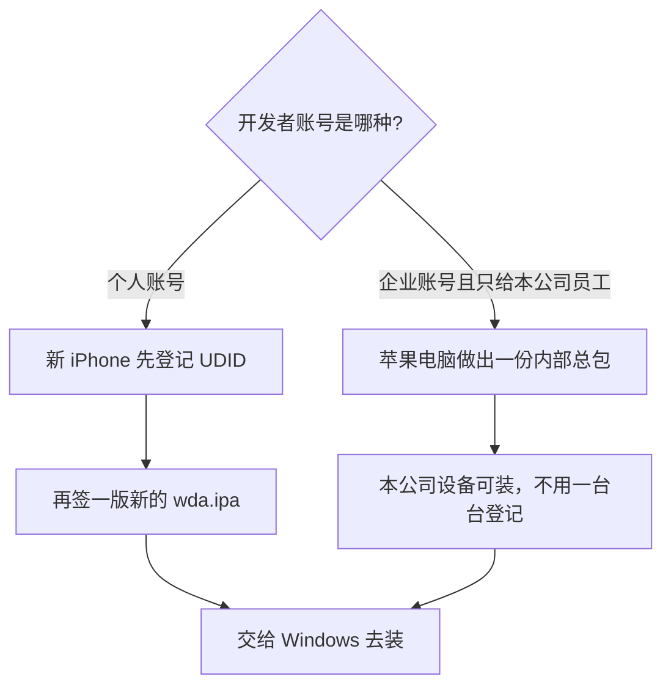

# 苹果电脑只负责：编出并签好控制器安装包

- 状态：出包脚本已落地；本机用现成 Runner.app 打过 IPA；真机重新签名未在本文重验
- 日期：2026-08-22
- 这是整条链路里 **Mac 独自负责的那一段**，和 Windows 天天发消息是两件事
- 总览：[wda-end-to-end-flow.md](./wda-end-to-end-flow.md)
- 下一段（Windows 装包启动）：[windows-night-runbook.md](../deployment/windows-night-runbook.md)

---

## 这一章只讲一件事

苹果电脑 **不是** 日常发 WhatsApp 的主机。  
它只做这一件事：

> 编出控制器，盖上开发者账号的章，交出一份 `wda.ipa`。

做好之后，这份包拷到 Windows（或任何一台日常电脑）。那边只负责插手机、安装、启动。  
**不要**在苹果电脑上整天开着发消息；**不要**指望 Windows 从零编出这份包。

```text
苹果电脑（偶尔做一次）
  登记手机 → 编译 → 签名 → 得到 wda.ipa
        │
        ▼
Windows / 日常主机（天天做）
  放下 wda.ipa → 点激活 → 手机顶上出现 Automation Running
```

---

## 为什么必须是苹果电脑

苹果规定：能装进 iPhone 的软件，必须用官方开发者账号盖章。盖章这件事，业内叫「签名」。

- 编译控制器、盖章，要用 Xcode，所以必须在苹果电脑上做。
- Windows 没有 Xcode，编不了、也签不了。它只能 **安装已经签好的包**。
- 用哪一种账号盖章，规则不一样。下面两节分开写：**个人账号** 和 **企业账号**。



---

## 个人账号注意

当前默认就是这种：**个人付费开发者账号**（Apple Developer Program，一年一续）。

开发或 Ad Hoc 安装，苹果要求先把设备登记进账号，才能做出能装进这台手机的描述文件。

1. 新买的 iPhone，先用数据线插上电脑，看机身编号：`idevice_id -l`（这个编号叫 UDID）。
2. 到苹果开发者后台的 [Devices](https://developer.apple.com/help/account/devices/register-a-single-device/) 把这台 UDID 登记进去。
3. **再**回苹果电脑签一版新的 `wda.ipa`。
4. 把**新包**拷给 Windows 去装。

**旧包装不上新机。** 上一台手机用过的那份 `wda.ipa`，描述文件里没有这台新 UDID，Windows 再怎么点激活也装不进去。不是网关坏了，是包还是旧的。

登记之后如果不重新签名、还拿旧包去装，结果一样：失败。顺序必须是 **先登记，再签新包，再安装**。

同一会员年度、同一产品系列（比如 iPhone）最多登记 [100 台](https://developer.apple.com/help/account/devices/devices-overview/)。额度用满了，要等下一年度才能清名单腾名额；年中删掉一台，名额不会马上回来。

个人账号过期、证书或描述文件过期，也要回苹果电脑重新盖章，再打一份新 `wda.ipa`。

---

## 企业账号注意

企业账号指 [Apple Developer Enterprise Program](https://developer.apple.com/programs/enterprise/)。它和上面的个人账号不是一回事，**不要当成「个人账号的加强版」**。

苹果写明：这个项目只给组织把**内部自用软件**发给**本公司员工**，走安全的内部系统或 MDM。不是给外面客户、代理商、买家装控制器用的。

和本项目有关的几点：

| | 企业账号（内部 In-House 分发） | 个人账号 |
|---|---|---|
| 新 iPhone 要不要先登记 UDID | 一般不用。同一份内部总包可以装到本公司多台设备 | **要。** 先登记，再签一版新 IPA，旧包装不上新机 |
| 谁可以装 | 本公司员工 | 已经登记进这个账号的那几台手机 |
| 第一份包、证书到期换包 | 还是要苹果电脑 | 还是要苹果电脑 |
| Windows 日常装包启动 | 可以，和现在一样只负责 install + 启动 | 可以 |
| 拿去给外面客户装 | **不行。** 违反条款，证书可能被苹果吊销 | 也不等于随便装：没登记的新机旧包装不上 |

企业账号就算申请下来了：

- 日常可以不用再一台一台登记，Windows 拿同一份包去装本公司的手机。
- **第一份包、证书到期、换账号，还是要回苹果电脑重新编译签名。** 不是「办了企业账号就永远不用 Mac」。
- 苹果说发行证书从签发日起大约三年有效，但会员资格一断或被吊销，包立刻不能用。
- 企业证书一旦被吊销，**所有用这张证签过的包一起失效**，所有已经装上的手机一起打不开。对外卖设备、给客户装，就是在赌这一下。
- 本仓库默认路径仍按个人账号写（先登记 UDID 再出包）。没有单独的「企业出包」脚本；真要换企业证书，是换签名身份后再跑同一套 `package-wda-ipa.sh`，不是换一种激活方式。

企业账号里如果只做开发 / Ad Hoc 测试、不用 In-House 内部包，苹果同样要求登记设备，额度也是每类设备每年 100 台。那种用法和新机规则跟个人账号一样，没有「免登记」这回事。

---

## 做之前要准备什么

| 要有 | 没有会怎样 |
|---|---|
| 一台苹果电脑，已装 Xcode | 编不了、签不了 |
| 开发者账号已登录 Xcode（个人或企业） | 盖不了章 |
| **个人账号**：这台 iPhone 的 UDID 已登记，并且用登记后的描述文件重新签过包 | 旧包装不上新机 |
| **企业账号（In-House）**：只给本公司员工装，不要拿去给外面的人 | 证书可能被整批吊销 |
| 旁边有 WDA 工程 `whatsapp_ai_ios/WhatsAppDeviceAgent`，**或** 本机已经编过、签过名的 `WebDriverAgentRunner-Runner.app` | 脚本找不到东西可打 |
| 本仓库里的 `scripts/package-wda-ipa.sh` | 不要手搓 zip，路径和签名容易弄坏 |

个人账号看 UDID：已插线、已信任的电脑上执行 `idevice_id -l`，登记到苹果开发者后台之后，**再**编译签名。企业账号走内部总包时，不必为每一台新机走这一步。

本仓库 **不包含** WDA 工程源码。工程在独立仓库 `whatsapp_ai_ios`，默认路径是网关仓库旁边的 `../whatsapp_ai_ios/WhatsAppDeviceAgent`。

---

## 怎么做出这份包

在网关仓库根目录执行：

```bash
sh scripts/package-wda-ipa.sh
```

默认产出：`dist/wda.ipa`。

脚本会：

1. 先找已经编过、签过名的 `WebDriverAgentRunner-Runner.app`（常见位置：本机网关 derived、仓库 `derived`、`/tmp/WebDriverAgentFarmDerived`）。
2. 找不到再调用 `xcodebuild build-for-testing` 编一次（需要本机有对应 iOS Platform；缺了会报 exit 70，不要反复点）。
3. 把 Runner.app 打成标准 IPA：`Payload/WebDriverAgentRunner-Runner.app`。
4. 装到手机上的 bundle 是 `com.wda.WebRunner.xctrunner`。

可选环境变量：

| 变量 | 含义 |
|---|---|
| `OUT` | 输出路径，默认 `dist/wda.ipa` |
| `PROJECT` | WDA 工程目录，默认仓库旁 `../whatsapp_ai_ios/WhatsAppDeviceAgent` |
| `DERIVED` | 已有编译产物目录；指定后优先用这里的 Runner.app |
| `TEAM` | `DEVELOPMENT_TEAM`；空则用工程里写死的值 |
| `SKIP_BUILD=1` | 只打包已有 Runner.app，不跑 xcodebuild |

已经有签过名的 derived、本机又缺 iOS Platform 时，用这一条，避免再踩 exit 70：

```bash
SKIP_BUILD=1 \
  DERIVED="$HOME/Library/Application Support/WDAFarmGateway/derived" \
  sh scripts/package-wda-ipa.sh
```

---

## 怎样算做成了

打开 `dist/wda.ipa`（其实是 zip）应能看到：

```text
Payload/WebDriverAgentRunner-Runner.app/
Payload/WebDriverAgentRunner-Runner.app/PlugIns/WebDriverAgentRunner.xctest/
```

不要把这份 IPA 提交进 git（仓库已忽略 `*.ipa`）。  
不要把开发者证书、p12、描述文件写进文档或打进网关安装包。

---

## 做成之后交给谁

把 `wda.ipa` 拷到日常主机的网关状态目录，文件名就叫 `wda.ipa`；或启动网关时用 `-ipa` 指到这份文件。

那边点激活：手机还没装控制器，会先安装这份包，再启动。  
苹果电脑这边的任务到「交出 IPA」就结束了。

下一段怎么装、怎么启动，不在本章：

- 不懂技术看总流程里的「安装启动」：[wda-end-to-end-flow.md](./wda-end-to-end-flow.md)
- 当晚逐步命令：[windows-night-runbook.md](../deployment/windows-night-runbook.md)

---

## 什么时候要重新做这一章

| 情况 | 要不要回苹果电脑 |
|---|---|
| 日常开机发消息 | 不要 |
| 重插线、重新点激活 | 不要（用已经交出的那份 `wda.ipa`） |
| 新买了一台 iPhone（个人账号） | 要：先登记 UDID，再签一版新 IPA。旧包装不上新机 |
| 新买了一台 iPhone（企业账号 In-House，且只给本公司员工） | 一般不用回苹果电脑；用已有总包即可 |
| 证书快到期、会员断了或已被吊销 | 要：重新盖章，再打一份新包 |
| 换了开发者账号 | 要 |
| Windows 上 `install` 失败，说未签名 / 设备不在描述文件里 | 个人账号：多半是这台手机没登记，或还在用旧包 |

---

## 常见失败

| 现象 | 先查 |
|---|---|
| `找不到 WDA 工程` | 设置 `PROJECT`，或先在 Xcode 编出 Runner.app 再设 `DERIVED` |
| `build-for-testing` exit 70 | 本机缺对应 iOS Platform。用已有 derived + `SKIP_BUILD=1`，不要反复编 |
| 包打出来了，Windows 装不进这台新手机 | 个人账号：没登记这台 UDID，或登记后还在用旧包。企业账号：先确认是不是拿内部包给外面的人装 |
| 装上了但启动立刻退出 | 手机里还没信任这个开发者（设置 → 通用 → VPN 与设备管理） |
| 把 Xcode 工程目录拷到 Windows 当日常路径 | 错了。Windows 要的是 `wda.ipa`，不是 `-project` |

---

## 本章不负责

- 不负责在 Windows 上发现手机、装包、拉起 XCTest
- 不负责打开 WhatsApp、打字、点发送
- 不负责把网关打成 `gateway.exe` 或 Mac 桌面端 DMG（那是另一份打包）
- 不负责企业证书对外分发
