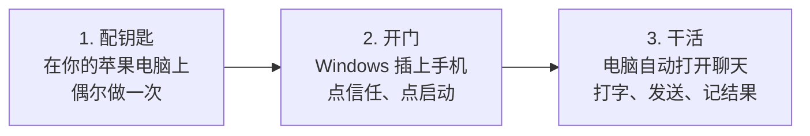
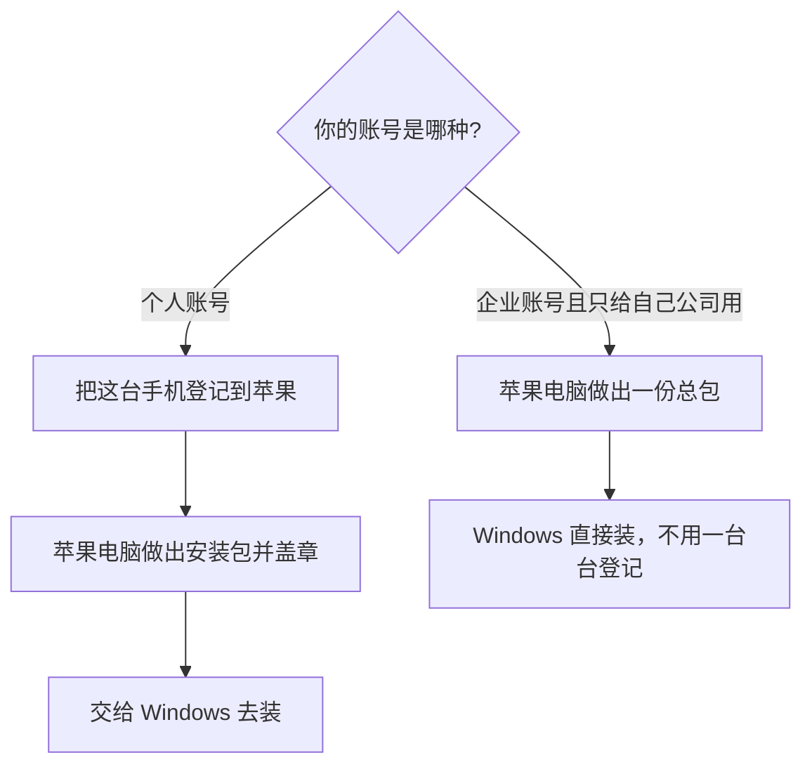
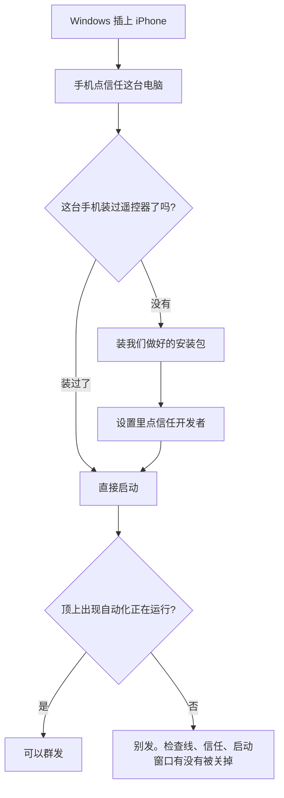

# 用 Windows 电脑给 iPhone 自动发 WhatsApp：怎么回事（大白话）

这份说明是写给**不写代码的人**看的：老板、运营、机房值班都可以读完。  
技术人员要命令和排错，请看文末链接。

---

## 先用一句人话讲完

苹果不允许别人的电脑直接替你点 WhatsApp。  
所以我们要在手机上装一个「遥控器」（业内叫 WDA）。电脑连上这个遥控器，才能替你打开聊天、打字、点发送。

遥控器**第一次做好**，必须用苹果电脑（Mac）和苹果开发者账号。  
做好之后，机房里的 **Windows 电脑就能天天用**，不用再买 Mac、不用装苹果开发软件。

可以把它想成：

> Mac = 配钥匙的地方  
> Windows = 日常开门干活的地方  
> 手机 = 真正发出去消息的那台 WhatsApp

---

## 整件事分三段

| 哪一段 | 谁来做 | 多久做一次 | 不懂技术可以记住 |
|---|---|---|---|
| 配钥匙 | 会用苹果电脑的人 | 新手机、证书快到期时 | 没有这把钥匙，Windows 插上也不听使唤 |
| 开门 | 机房 / Windows 值班 | 每天开机、重插线时 | 手机顶上出现英文「正在运行自动化」就对了 |
| 干活 | 我们的发送软件自动做 | 每条消息 | 发出去要看到气泡，输入框要变空 |

---

## 第一段：配钥匙（苹果电脑上）

苹果规定：谁家的软件能装进 iPhone，要有官方账号盖章。这个盖章就是「签名」。

你现在是**个人开发者账号（一年一交）**，规则比较严：

1. 每一台要用的 iPhone，先把机身编号登记到苹果后台（这个编号叫 UDID，相当于手机身份证）。  
2. 用苹果电脑做出「遥控器」安装包。  
3. 盖上你的章。  
4. 拷给 Windows 用。

**新买的手机不能直接拿旧包装。** 必须先登记这台新机，再盖一次章，再安装。一年大概能登记一百台。

如果以后改成**企业账号**（公司内部用）：

- 好处：一般不用一台一台登记，同一份包装多台。  
- 坏处：苹果规定这是给**本公司员工**用的。拿去给外面客户装，证书可能被苹果一键作废，**所有手机一起罢工**。对外卖设备别赌这个。

证书大约一年到期，到期回苹果电脑重新盖一次章。

---

## 第二段：开门（Windows 上天天做）

机房电脑是 Windows。要准备：

1. 装苹果官方的「Apple 设备」或 iTunes（让电脑认得 iPhone）。  
2. 数据线插上，手机弹出「信任这台电脑」——点信任。  
3. 如果这台手机还没装过遥控器：用我们提供的安装包装进去。  
4. 手机打开 **设置 → 通用 → VPN 与设备管理**，信任开发者。  
5. 启动遥控器。手机最顶上出现一行英文：  
   **Automation Running**（大意：自动化正在运行，同时按两个音量键可停止）  
   这和竞品视频里那条提示是同一回事，说明门开了。  
6. 发送软件显示设备在线，就可以干活。

注意三件生活常识：

- 启动遥控器的那个窗口**不要关**。关掉就等于拔了遥控器电源。  
- 别指望只靠手机 Wi‑Fi。手机一锁屏，网一断，电脑就找不到它。要用数据线。  
- 门没开就去群发，一定失败。先看手机顶上那行英文。

---

## 第三段：干活（软件自动发 WhatsApp）

门开了之后，Windows 还是 Mac 都一样。软件会：

1. 打开指定号码的聊天  
2. 打上要发的字  
3. 点发送  
4. 确认输入框空了（空了才算真的发出去，避免假装成功）  
5. 记下成功或失败，回报后台  
6. 下一条号码重复

一次任务共用同一个遥控器，不要每条消息都重新插拔一次。重新插拔会很慢；连着发，一条大约几秒钟。

怎样算成功（和竞品视频同一标准）：

- 进对了那个人的聊天  
- 字打上去了  
- 出现绿色气泡  
- 下面输入框是空的  
- 后台显示发送成功  

---

## 谁干什么、谁别干什么

| 人 / 机器 | 负责 | 不用管 |
|---|---|---|
| 你的苹果电脑 | 配钥匙、登记新手机、证书到期重新盖章 | 不用整天开着发消息 |
| 机房 Windows | 插线、点信任、开门、跑发送软件 | 不用装苹果开发软件 |
| iPhone | 登 WhatsApp、点信任、别把线拔了 | 不用懂电脑 |
| 值班的人 | 看顶上那行英文在不在、线通不通 | 不用改代码 |

---

## 常见误会

**「Windows 上点一下就能从零做出遥控器吗？」**  
不能。Windows 只会**开门**。钥匙必须先在苹果电脑上配好。

**「申请了企业账号，是不是永远不用苹果电脑了？」**  
日常可以不用。做出第一份包、证书到期换新包，还是要苹果电脑。

**「个人账号编个安装包，Windows 随便装哪台手机都行？」**  
不行。没登记过的新手机，旧包装不上去。要先登记，再盖章，再装。

**「电脑上的发送软件能代替遥控器吗？」**  
不能。没有手机上的遥控器，电脑摸不到 WhatsApp 的发送键。

---

## 给会操作电脑的同事（可跳过）

逐步命令和故障表：[Windows 当晚手册](../deployment/windows-night-runbook.md)  
激活原理：[Windows 激活说明](./windows-wda-activation.md)  
打包 Windows 软件：[gateway.exe 打包](../deployment/windows-exe打包.md)
