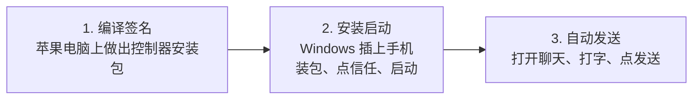
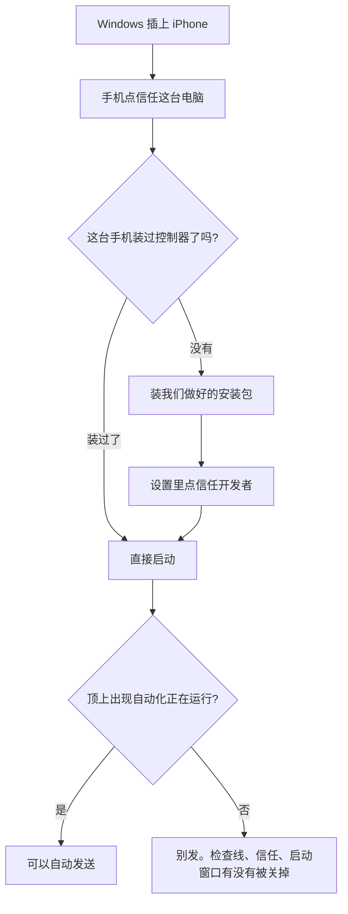

# 用 Windows 电脑给 iPhone 自动发 WhatsApp：怎么回事（大白话）

这份说明是写给**不写代码的人**看的：老板、运营、值班都可以读完。  
技术人员要命令和排错，请看文末链接。

---

## 先用一句人话讲完

苹果不允许别人的电脑直接替你点 WhatsApp。  
所以我们要在手机上装一个「控制器」（业内叫 WDA）。电脑连上这个控制器，才能替你打开聊天、打字、点发送。

控制器第一次必须在苹果电脑上**编译**出来，并**签好名**。  
做好之后，平时用的 **Windows 电脑就能天天跑**，不用再买 Mac、不用装苹果开发软件。

三台机器各管一段：

> Mac = **编译签名**控制器安装包  
> Windows = **安装启动**控制器  
> 手机 = 真正发出 WhatsApp 的那台

---

## 整件事分三段

| 哪一段 | 谁来做 | 多久做一次 | 不懂技术可以记住 |
|---|---|---|---|
| 编译签名 | 会用苹果电脑的人 | 新手机、证书快到期时 | 做出一份 `wda.ipa`，没有这份包 Windows 装不上 |
| 安装启动 | 用 Windows 的人 | 每天开机、重插线时 | 把包放到发送软件旁边，点激活；顶上出现英文「正在运行自动化」就对了 |
| 自动发送 | 发送软件自动做 | 每条消息 | 发出去要看到气泡，输入框要变空 |

---

## 第一段：编译签名（苹果电脑上）

这一段是苹果电脑 **独自负责** 的工作，单独写成一章：

**[苹果电脑只负责：编出并签好控制器安装包](./mac-wda-ipa-package.md)**

这里只记结论：

- 苹果电脑偶尔做一次：编译 → 签名 → 交出 `wda.ipa`。日常发消息不用开这台电脑。
- **个人账号**：新 iPhone 要先登记 UDID，再签一版新 IPA。旧包装不上新机。
- **企业账号**：一般不用一台台登记，同一份内部总包可装本公司多台；只给本公司员工用。拿去给外面客户装，证书可能被整批吊销，所有手机一起罢工。第一份包和证书到期，还是要回苹果电脑。

---

## 第二段：安装启动（Windows 上天天做）

平时用的电脑是 Windows。要准备：

1. 装苹果官方的「Apple 设备」或 iTunes（让电脑认得 iPhone）。  
2. 数据线插上，手机弹出「信任这台电脑」——点信任。  
3. 如果这台手机还没装过控制器：把苹果电脑做好的 `wda.ipa` 放到发送软件目录里，点激活会自动装进去。  
4. 手机打开 **设置 → 通用 → VPN 与设备管理**，信任开发者。  
5. 启动控制器。iOS 15–16 直接装包拉起；iOS 17 及以上网关会先开隧道再拉起（不用另开命令窗口）。手机最顶上出现一行英文：  
   **Automation Running**（大意：自动化正在运行，同时按两个音量键可停止）  
   这和竞品视频里那条提示是同一回事，说明门开了。  
6. 发送软件显示设备在线，就可以自动发送。

注意三件生活常识：

- 启动控制器的那个窗口**不要关**。关掉就等于拔了控制器电源。  
- 别指望只靠手机 Wi‑Fi。手机一锁屏，网一断，电脑就找不到它。要用数据线。  
- 门没开就去群发，一定失败。先看手机顶上那行英文。

---

## 第三段：自动发送（软件发 WhatsApp）

门开了之后，Windows 还是 Mac 都一样。软件会：

1. 打开指定号码的聊天  
2. 打上要发的字  
3. 点发送  
4. 确认输入框空了（空了才算真的发出去，避免假装成功）  
5. 记下成功或失败，回报后台  
6. 下一条号码重复

一次任务共用同一个控制器，不要每条消息都重新插拔一次。重新插拔会很慢；连着发，一条大约几秒钟。

怎样算成功（和竞品视频同一标准）：

- 进对了那个人的聊天  
- 字打上去了  
- 出现绿色气泡  
- 下面输入框是空的  
- 后台显示发送成功  

---

## 谁干什么、谁别干什么

| 人 / 机器 | 负责 | 不用管 |
|---|---|---|
| 你的苹果电脑 | 编译签名、登记新手机、证书到期再签一次 | 不用整天开着发消息 |
| 日常 Windows 电脑 | 插线、点信任、安装启动控制器、跑发送软件 | 不用装苹果开发软件 |
| iPhone | 登 WhatsApp、点信任、别把线拔了 | 不用懂电脑 |
| 值班的人 | 看顶上那行英文在不在、线通不通 | 不用改代码 |

---

## 常见误会

**「Windows 上点一下就能从零编译出控制器吗？」**  
不能。Windows 只负责**安装启动**。编译和签名必须先在苹果电脑上做完。

**「申请了企业账号，是不是永远不用苹果电脑了？」**  
日常可以不用再一台一台登记。做出第一份包、证书到期换新包，还是要苹果电脑。而且只能给本公司员工装，不能拿去给外面客户。

**「个人账号编个安装包，Windows 随便装哪台手机都行？」**  
不行。新 iPhone 要先登记 UDID，再签一版新 IPA。旧包装不上新机。

**「电脑上的发送软件能代替控制器吗？」**  
不能。没有手机上的控制器，电脑摸不到 WhatsApp 的发送键。

---

## 给会操作电脑的同事（可跳过）

苹果电脑出包（独立章节）：[编出并签好控制器安装包](./mac-wda-ipa-package.md)  
逐步命令和故障表：[Windows 当晚手册](../deployment/windows-night-runbook.md)  
激活原理：[Windows 激活说明](./windows-wda-activation.md)  
USB / Network 互斥与首次授权：[usb-network-activate.md](./usb-network-activate.md)  
打包 Windows 软件：[gateway.exe 打包](../deployment/windows-exe打包.md)
